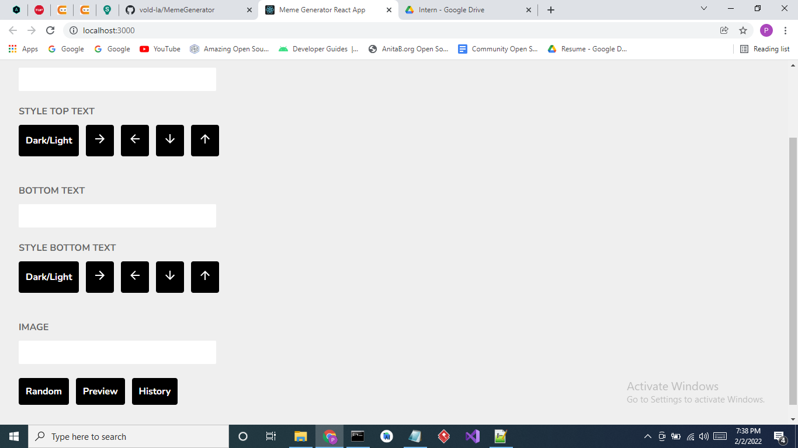
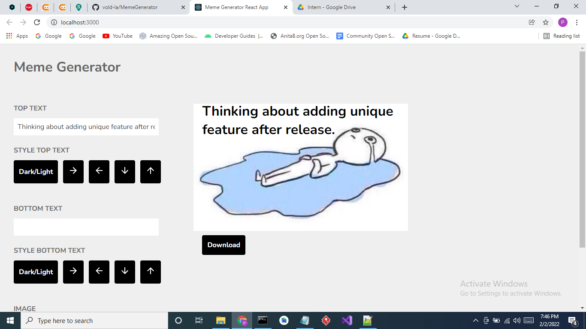
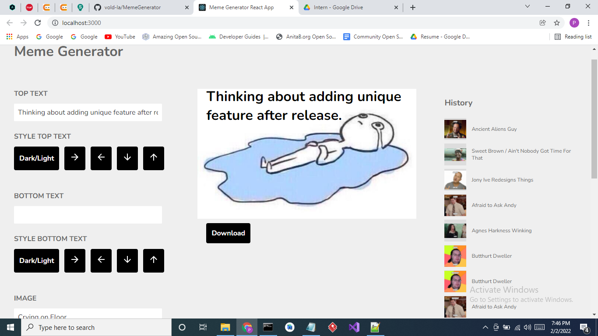

# `Meme Generator`
Note - this is in active development.   

User can create meme by selecting random image or from image list. They can add top & bottom text and position/style them as per their need.
Also they can see their previously created works.

#### Screenshots

[Video Demo](https://drive.google.com/file/d/1mMcjAmQpoRLQn9GbNbh_kPG1aeXMjBU2/view?usp=sharing)

<table>
   <tr align=center>
     <td  colspan=3>Home Page </td>
<td>
It contains bottom,top input field with styling feature. Preview Button - To Generate Meme Random Button - Select random image from list 
</td>
  </tr>
  <tr>
    <td>Demo Page </td>
<td>

Clicking on Preview will create a section with generated meme .  For downloading part, I have used Dom Selector to select this section and convert it into Image.

</td>
</tr><tr>
    <td>History Page </td>
<td>
This part contains all your previously created works
</td>
</tr><tr>
    <td>Created Meme</td>
<td></td>
  </tr>
</table>

### `Ongoing development`
- create option to share in different platform / copy the url.
- Store the created meme in cloudinary.

## Built With

<table  align=center>
  <tr>
   <td align=center> </td>
    <td align=center> </td>
   <td align=center> </td>
     
  </tr>

</table>

### `Installation and Setup Instructions`

- Clone down this repository. You will need `node` and `npm` installed globally on your machine.
- Installation:`npm install`
- To Run Test Suite:`npm test`
- To Start Server: `npm start`
- To Visit app locally: `localhost:3000/`

## Show your support

Give a star if you like this project!  
Contributions & feedbacks are welcome!

